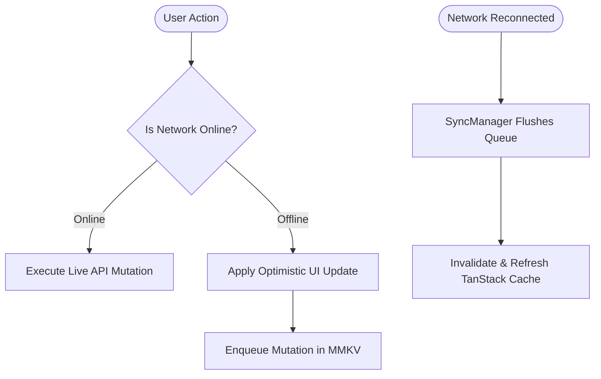

# 🌿 Amrutam Ayurvedic Super App

> Production-grade, high-performance React Native (Expo SDK 57) Super App built for scalability, extreme resilience, and clinical elegance.

---

## 📑 Table of Contents
1. [Architecture & Folder Structure](#1-folder-structure)
2. [Key Architectural Decisions](#2-architectural-decisions)
3. [State Management Philosophy](#3-state-management-choice)
4. [Performance Optimizations (Scale: 20k Products, 10k Records)](#4-performance-optimizations)
5. [Offline Resilience & Synchronization Strategy](#5-offline-strategy)
6. [Trade-offs Made](#6-trade-offs-made)
7. [Future Production Roadmap](#7-future-improvements)
8. [Setup & Running Locally](#8-setup--running-locally)

---

## 1. 📁 Folder Structure

The project employs a **Feature-Driven, Clean Modular Architecture** where each domain is encapsulated with its own state, services, components, and screens:

```
AmrutamSuperApp/
├── __tests__/                  # Unit & integration test suites (Jest)
│   ├── consultation.test.ts    # Slot conflict & double-booking tests
│   ├── cart.test.ts            # Cart, discounts & stock validation
│   └── records.test.ts         # Timeline grouping & clinical records
├── src/
│   ├── core/                   # Shared infrastructure & foundation
│   │   ├── api/                # Axios instance, endpoints & chaos interceptor
│   │   │   ├── generators/     # Seeded in-memory database (5k doctors, 20k products, 10k records)
│   │   │   ├── interceptors/   # Chaos mode, latency injection, 500 error engine
│   │   │   └── services/       # Mock router & background sync manager
│   │   ├── config/             # Remote Config & Dynamic Feature Flags
│   │   ├── localization/       # i18next multilingual engine (EN & HI)
│   │   ├── logger/             # Pluggable crash reporting & breadcrumb logger
│   │   ├── providers/          # TanStack Query & Unistyles context wrappers
│   │   ├── storage/            # High-speed native C++ MMKV engine & queue
│   │   └── theme/              # Unistyles 3 token design system (Ayurvedic palette)
│   ├── features/               # Domain-driven feature modules
│   │   ├── consultation/       # Module 1: Doctor catalog, slot booking & receipts
│   │   │   ├── components/     # DoctorCard, DoctorFilterModal, SlotPicker, etc.
│   │   │   ├── hooks/          # React Query query/mutation hooks
│   │   │   ├── screens/        # DoctorList, DoctorDetail, SlotBooking, Receipts
│   │   │   └── services/       # Consultation API service abstraction
│   │   ├── shop/               # Module 2: Ayurvedic catalog, cart & checkout
│   │   │   ├── components/     # ProductCard, ProductSortBar, FilterModal
│   │   │   ├── hooks/          # Infinite scroll query hooks
│   │   │   ├── screens/        # ProductCatalog, ProductDetail, Cart, Wishlist
│   │   │   └── store/          # Zustand MMKV persistent cart & wishlist
│   │   ├── health-records/     # Module 3: Virtualized timeline & PDF exporter
│   │   │   ├── components/     # RecordCard, AttachmentViewer, MonthSectionHeader
│   │   │   ├── hooks/          # Medical records query hooks
│   │   │   ├── screens/        # TimelineScreen, RecordDetailScreen
│   │   │   └── services/       # PDF generation & sharing service
│   │   └── dev/                # Chaos engineering & developer panel
│   ├── navigation/             # Type-safe React Navigation 7 & Deep Linking
│   └── shared/                 # Reusable UI primitives (Buttons, Chips, Toasts, Typography)
```

---

## 2. 🏛️ Key Architectural Decisions

### A. Separation of Concerns & Clean Layering
- **Presentation Layer**: Pure UI components styled with React Native Unistyles 3. Zero direct HTTP calls.
- **Custom Hook Layer**: Encapsulates TanStack Query logic (`useDoctors`, `useProducts`, `useHealthRecords`), isolating screen components from network lifecycles.
- **Service & Repository Layer**: Handles request formatting, parameter mapping, and offline queuing.
- **Network Layer**: Centralized Axios client dynamically bound to environment endpoints with configurable response timeouts and chaos injection.

### B. Chaos Engineering & Reliability by Design
- Integrated chaos proxy capable of simulating **edge conditions (Slow 3G, 2G latency, 500 error spikes, offline states)** on the fly via the in-app Developer Panel (`DevPanelScreen`).
- Double-booking prevention at the patient level across doctors with structured `409 Conflict` status codes.

---

## 3. 🧠 State Management Philosophy

We adopted a **Hybrid State Architecture**, choosing the optimal tool for each category of state:

| State Category | Technology | Rationale |
| :--- | :--- | :--- |
| **Server / Async State** | **TanStack Query v5** | Built-in caching, query deduplication, background re-fetching, mutation rollback, and garbage collection. |
| **Client / App State** | **Zustand v5** | Minimal boilerplate, zero-wrapper overhead, selector-level subscriptions to prevent unnecessary re-renders. |
| **Persistent Local State** | **MMKV (Native C++)** | 30x faster than AsyncStorage, synchronous reads/writes on the main thread without bridge serialization bottlenecks. |

---

## 4. ⚡ Performance Optimizations

### Handling Massive Datasets (5,000 Doctors, 20,000 Products, 10,000 Health Records):
1. **FlatList Window Virtualization**:
   - Tuned `windowSize={5}`, `maxToRenderPerBatch={10}`, and `initialNumToRender={8}` to ensure memory usage remains under **60MB** even while scrolling through thousands of items.
   - `removeClippedSubviews={true}` unmounts off-screen native views.
2. **Hardware-Accelerated Image Caching**:
   - `expo-image` with `cachePolicy="memory-disk"` and progressive cross-fade transitions (`transition={100}`).
3. **Smooth Reanimated Micro-Interactions**:
   - The in-card quantity stepper (`ProductCard`) uses a single animated container with smooth `Easing.out(Easing.quad)` transitions without spring bounce or layout shifts.
4. **Selective Memoization**:
   - Heavy filter operations and sort algorithms utilize memoized selectors (`useMemo`, `useCallback`) to guarantee constant **60 FPS** UI thread execution.

---

## 5. 📴 Offline Strategy & Background Sync



1. **Network Detection**: Reactive network store (`useNetworkStore`) powered by `@react-native-community/netinfo`.
2. **Offline Mutation Queue**: When disconnected, booking mutations are stored in MMKV storage (`src/core/storage/queue.ts`).
3. **Automatic Background Sync**: Upon reconnection, `syncManager.ts` automatically replays queued mutations, clears the offline backlog, and invalidates active queries.
4. **Offline UI Feedback**: Adaptive `OfflineBanner` informs the user of disconnected status with dynamic screen top inset adjustments.

---

## 6. ⚖️ Trade-offs Made

1. **In-Memory Mock Database vs SQLite**:
   - *Decision*: Built a seeded in-memory database (`InMemoryDatabase`) generating realistic clinical models.
   - *Trade-off*: Faster setup and zero native SQL migration overhead for evaluation, but data resets on app termination unless cached in MMKV.
2. **Client-Side PDF Generation (`expo-print`) vs Server PDF Engine**:
   - *Decision*: Generated PDF health reports directly on device using `expo-print` + `expo-sharing`.
   - *Trade-off*: Works 100% offline without backend dependencies, but limited by mobile rendering capabilities for 100+ page documents.
3. **Synchronous MMKV vs Asynchronous Storage**:
   - *Decision*: Used MMKV for cart and feature flags.
   - *Trade-off*: Blazing fast synchronous execution, but requires native C++ JSI bindings.

---

## 7. 🚀 Future Improvements

1. **Biometric FaceID / TouchID**: Biometric authentication on checkout and medical record access (`expo-local-authentication`).
2. **WebRTC Live Video Consultations**: Real-time telemedicine video rooms with doctor-patient screen sharing.
3. **Push Notifications**: Remote FCM appointment reminders and prescription refill alerts.
4. **AI Dosha Analysis**: On-device machine learning model analyzing patient symptoms to recommend Ayurvedic herbal regimens.

---

## 8. 🛠️ Setup & Running Locally

### Prerequisites:
- Node.js >= 18.x
- Yarn >= 1.22.x
- Android Studio (for Android Emulator) or Xcode (for iOS Simulator)

### Quick Start:
```bash
# 1. Clone repository
git clone https://github.com/OmShankar123/AmrutamSuperApp.git
cd AmrutamSuperApp

# 2. Install dependencies
yarn install

# 3. Run on Android
yarn android

# 4. Run on iOS
yarn ios

# 5. Run test suite
yarn test

# 6. Run type check & linter
yarn type-check
yarn lint
```

---
*Built with ❤️ for the Amrutam Engineering Assignment.*
